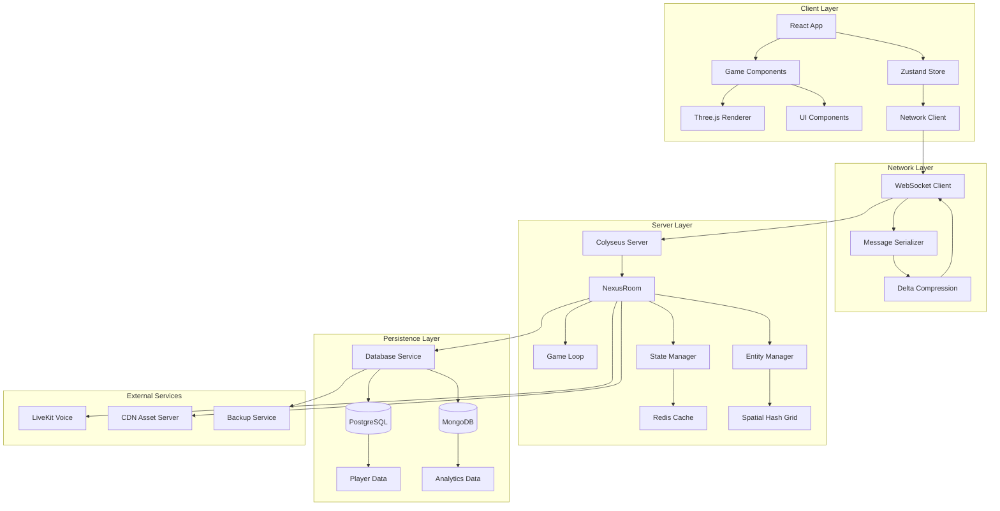
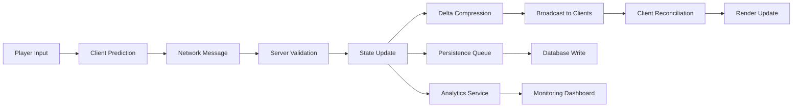
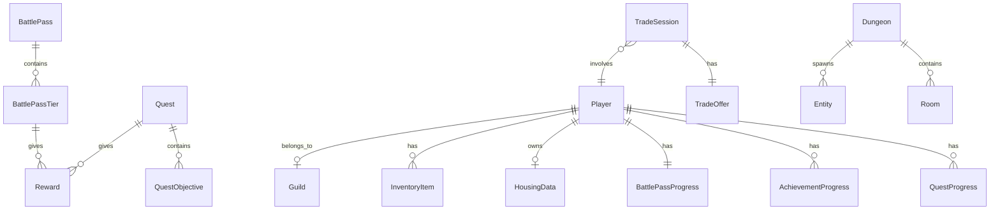
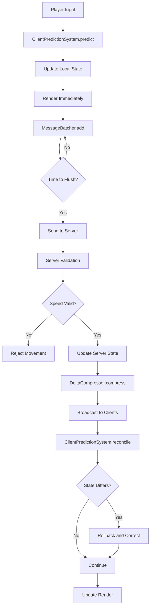
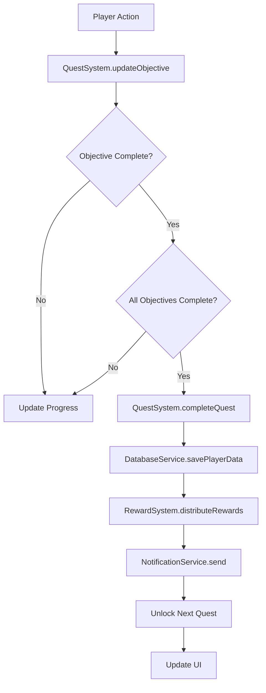
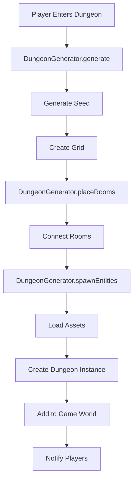
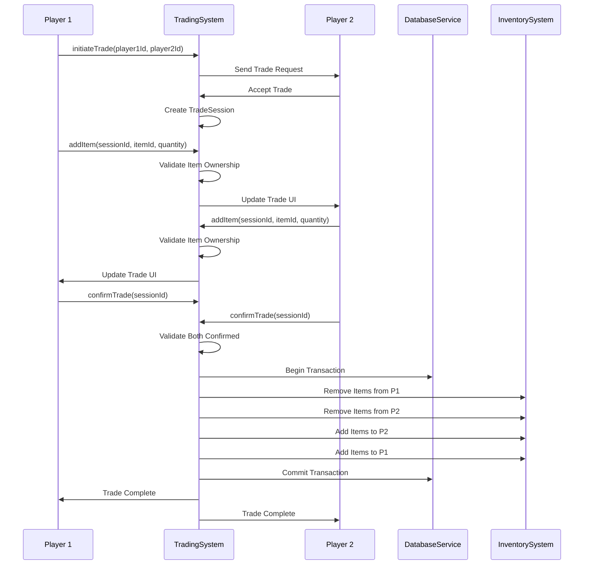
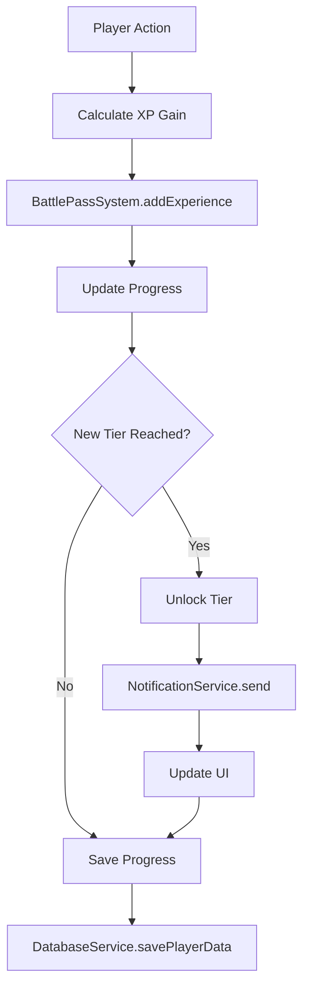
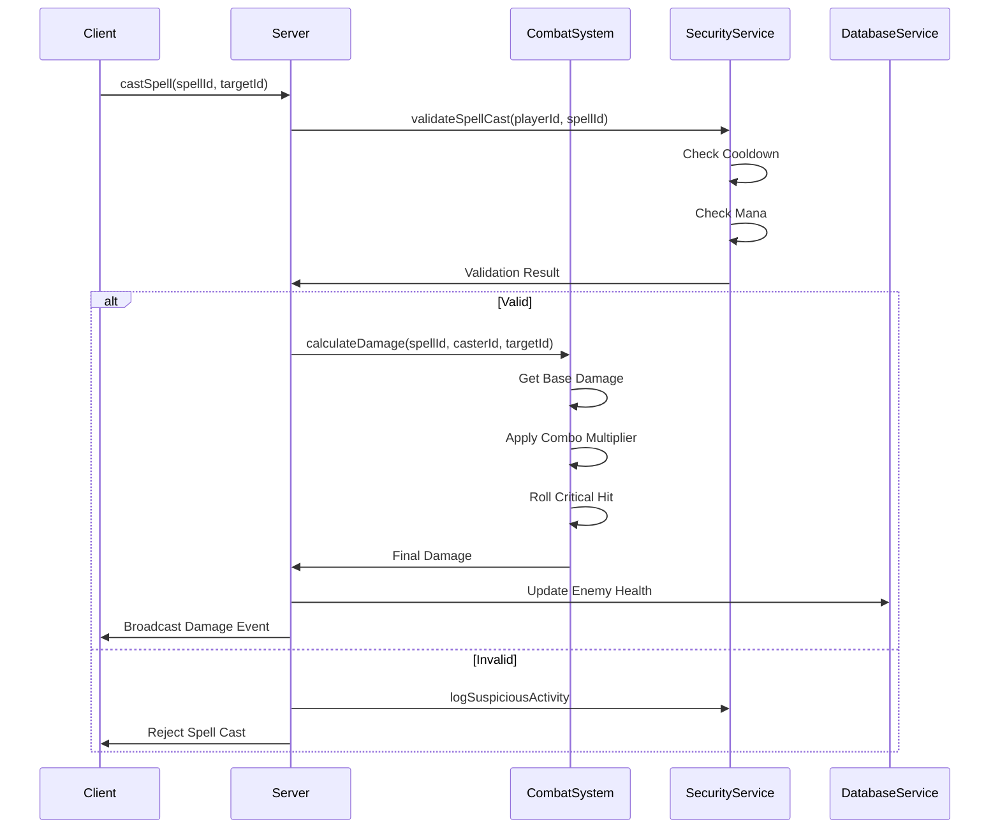

# Design Document

## Overview

This design document provides a comprehensive architectural and implementation design for expanding and optimizing the NEX://VOID mobile cyberpunk MMO. The design addresses performance optimization, scalability improvements, code architecture enhancements, and new feature implementations while maintaining backward compatibility and the mobile-first approach.

The design is organized into several key areas:
- **Performance Optimization**: Client and server-side optimizations for 60 FPS gameplay and 1000+ concurrent players
- **Architecture Improvements**: Better code organization, shared packages, and maintainability
- **New Features**: Quest system, battle pass, procedural dungeons, player housing, trading, achievements, and enhanced social features
- **Infrastructure**: Database persistence, monitoring, security, and scalability

## Architecture Design

### System Architecture Diagram



### Data Flow Diagram



## Component Design

### Performance Optimization Components

#### ObjectPool<T>
- **Responsibilities**: 
  - Manage reusable object instances to minimize garbage collection
  - Provide get/release methods for object lifecycle
  - Track pool size and usage statistics
- **Interfaces**:
  ```typescript
  interface ObjectPool<T> {
    get(): T
    release(obj: T): void
    clear(): void
    getStats(): { total: number; active: number; available: number }
  }
  ```
- **Dependencies**: None (standalone utility)

#### SpatialHashGrid
- **Responsibilities**:
  - Partition 3D space into grid cells for efficient spatial queries
  - Support insertion, removal, and query operations
  - Optimize collision detection and interest management
- **Interfaces**:
  ```typescript
  interface SpatialHashGrid<T> {
    insert(entity: T, position: Vector3): void
    remove(entity: T): void
    query(position: Vector3, radius: number): T[]
    clear(): void
  }
  ```
- **Dependencies**: Vector3 type from shared package

#### DeltaCompressor
- **Responsibilities**:
  - Compare current state with previous state
  - Generate minimal delta updates
  - Decompress deltas on client side
- **Interfaces**:
  ```typescript
  interface DeltaCompressor {
    compress(current: any, previous: any): DeltaUpdate
    decompress(base: any, delta: DeltaUpdate): any
  }
  ```
- **Dependencies**: State schema definitions

#### LODManager
- **Responsibilities**:
  - Manage level-of-detail for 3D objects based on distance
  - Switch between different detail levels
  - Optimize rendering performance
- **Interfaces**:
  ```typescript
  interface LODManager {
    update(cameraPosition: Vector3): void
    setLODLevel(entity: Entity, level: number): void
    getLODLevel(entity: Entity, distance: number): number
  }
  ```
- **Dependencies**: Three.js, Entity system

### Network Optimization Components

#### ClientPredictionSystem
- **Responsibilities**:
  - Predict player movement client-side for immediate feedback
  - Reconcile with server state when updates arrive
  - Handle rollback for incorrect predictions
- **Interfaces**:
  ```typescript
  interface ClientPredictionSystem {
    predict(input: PlayerInput): void
    reconcile(serverState: PlayerState): void
    rollback(): void
  }
  ```
- **Dependencies**: Player state, input system

#### InterestManager
- **Responsibilities**:
  - Determine which entities are relevant to each player
  - Filter network updates based on distance and relevance
  - Reduce bandwidth usage
- **Interfaces**:
  ```typescript
  interface InterestManager {
    getRelevantEntities(playerId: string, position: Vector3): Entity[]
    shouldSendUpdate(entity: Entity, playerId: string): boolean
  }
  ```
- **Dependencies**: SpatialHashGrid, Entity system

#### MessageBatcher
- **Responsibilities**:
  - Batch multiple messages into single network packets
  - Optimize network overhead
  - Handle message prioritization
- **Interfaces**:
  ```typescript
  interface MessageBatcher {
    add(message: NetworkMessage, priority: number): void
    flush(): NetworkPacket
    setBatchInterval(ms: number): void
  }
  ```
- **Dependencies**: Network message types

### New Feature Components

#### QuestSystem
- **Responsibilities**:
  - Manage quest definitions and player quest states
  - Track quest progress and objectives
  - Handle quest completion and rewards
- **Interfaces**:
  ```typescript
  interface QuestSystem {
    acceptQuest(playerId: string, questId: string): void
    updateObjective(playerId: string, questId: string, objectiveId: string, progress: number): void
    completeQuest(playerId: string, questId: string): void
    getActiveQuests(playerId: string): Quest[]
  }
  ```
- **Dependencies**: Database service, reward system

#### BattlePassSystem
- **Responsibilities**:
  - Manage battle pass seasons and tiers
  - Track player progress and experience
  - Handle reward distribution
- **Interfaces**:
  ```typescript
  interface BattlePassSystem {
    addExperience(playerId: string, amount: number): void
    unlockTier(playerId: string, tier: number): void
    claimReward(playerId: string, tier: number, track: 'free' | 'premium'): void
    getProgress(playerId: string): BattlePassProgress
  }
  ```
- **Dependencies**: Database service, reward system

#### DungeonGenerator
- **Responsibilities**:
  - Generate procedural dungeon layouts
  - Place rooms, corridors, and obstacles
  - Spawn enemies and loot
- **Interfaces**:
  ```typescript
  interface DungeonGenerator {
    generate(seed: number, difficulty: number): DungeonLayout
    placeRooms(layout: DungeonLayout): Room[]
    connectRooms(rooms: Room[]): Corridor[]
    spawnEntities(layout: DungeonLayout, level: number): Entity[]
  }
  ```
- **Dependencies**: Random number generator, entity spawner

#### TradingSystem
- **Responsibilities**:
  - Manage player-to-player trades
  - Validate trade offers and execute transactions
  - Handle trade restrictions and security
- **Interfaces**:
  ```typescript
  interface TradingSystem {
    initiateTrade(player1Id: string, player2Id: string): TradeSession
    addItem(sessionId: string, playerId: string, itemId: string, quantity: number): void
    confirmTrade(sessionId: string, playerId: string): void
    cancelTrade(sessionId: string): void
  }
  ```
- **Dependencies**: Inventory system, validation service

#### HousingSystem
- **Responsibilities**:
  - Manage player housing instances
  - Handle furniture placement and decoration
  - Persist housing state
- **Interfaces**:
  ```typescript
  interface HousingSystem {
    loadHousing(playerId: string): HousingInstance
    placeFurniture(playerId: string, furnitureId: string, position: Vector3, rotation: number): void
    removeFurniture(playerId: string, furnitureId: string): void
    visitHousing(playerId: string, ownerId: string): void
  }
  ```
- **Dependencies**: Database service, 3D rendering system

### Infrastructure Components

#### DatabaseService
- **Responsibilities**:
  - Provide abstraction for database operations
  - Handle connection pooling and retries
  - Support transactions and migrations
- **Interfaces**:
  ```typescript
  interface DatabaseService {
    savePlayerData(playerId: string, data: PlayerData): Promise<void>
    loadPlayerData(playerId: string): Promise<PlayerData>
    query<T>(query: string, params: any[]): Promise<T[]>
    transaction<T>(callback: (tx: Transaction) => Promise<T>): Promise<T>
  }
  ```
- **Dependencies**: Database driver (PostgreSQL/MongoDB)

#### MonitoringService
- **Responsibilities**:
  - Collect performance metrics and logs
  - Expose metrics via API
  - Trigger alerts on thresholds
- **Interfaces**:
  ```typescript
  interface MonitoringService {
    recordMetric(name: string, value: number, tags: Record<string, string>): void
    logEvent(level: 'info' | 'warn' | 'error', message: string, context: any): void
    getMetrics(timeRange: TimeRange): Metric[]
    setAlert(condition: AlertCondition, callback: () => void): void
  }
  ```
- **Dependencies**: Time series database, logging service

#### SecurityService
- **Responsibilities**:
  - Validate player actions server-side
  - Detect and log suspicious behavior
  - Implement anti-cheat measures
- **Interfaces**:
  ```typescript
  interface SecurityService {
    validateMovement(playerId: string, from: Vector3, to: Vector3, timestamp: number): boolean
    validateDamage(playerId: string, damage: number, targetId: string): boolean
    detectCheating(playerId: string, action: PlayerAction): SuspicionLevel
    logSuspiciousActivity(playerId: string, reason: string, data: any): void
  }
  ```
- **Dependencies**: Game state, validation rules

## Data Model

### Core Data Structure Definitions

#### Player Data Model
```typescript
interface PlayerData {
  id: string
  name: string
  race: Race
  level: number
  xp: number
  credits: number
  position: Vector3
  rotation: number
  health: number
  maxHealth: number
  mana: number
  maxMana: number
  inventory: InventoryItem[]
  equippedSpells: string[]
  guildId?: string
  guildTag?: string
  achievements: AchievementProgress[]
  quests: QuestProgress[]
  battlePass: BattlePassProgress
  housing?: HousingData
  stats: PlayerStats
  createdAt: Date
  lastLogin: Date
}
```

#### Quest Data Model
```typescript
interface Quest {
  id: string
  name: string
  description: string
  category: 'main' | 'side' | 'daily' | 'weekly'
  level: number
  prerequisites: string[]
  objectives: QuestObjective[]
  rewards: Reward[]
  repeatable: boolean
  timeLimit?: number
}

interface QuestObjective {
  id: string
  type: 'kill' | 'collect' | 'reach' | 'craft' | 'complete'
  target: string
  quantity: number
  current: number
}

interface QuestProgress {
  questId: string
  status: 'active' | 'completed' | 'failed'
  objectives: QuestObjective[]
  startedAt: Date
  completedAt?: Date
}
```

#### Battle Pass Data Model
```typescript
interface BattlePass {
  id: string
  season: number
  name: string
  startDate: Date
  endDate: Date
  tiers: BattlePassTier[]
}

interface BattlePassTier {
  tier: number
  xpRequired: number
  freeRewards: Reward[]
  premiumRewards: Reward[]
}

interface BattlePassProgress {
  season: number
  currentTier: number
  currentXP: number
  premiumUnlocked: boolean
  claimedTiers: number[]
}
```

#### Dungeon Data Model
```typescript
interface Dungeon {
  id: string
  seed: number
  difficulty: number
  level: number
  layout: DungeonLayout
  rooms: Room[]
  entities: Entity[]
  completed: boolean
  completedAt?: Date
}

interface DungeonLayout {
  width: number
  height: number
  depth: number
  grid: Cell[][][]
}

interface Room {
  id: string
  type: 'start' | 'normal' | 'boss' | 'treasure'
  bounds: BoundingBox
  connections: string[]
}
```

#### Trading Data Model
```typescript
interface TradeSession {
  id: string
  player1Id: string
  player2Id: string
  player1Offer: TradeOffer
  player2Offer: TradeOffer
  player1Confirmed: boolean
  player2Confirmed: boolean
  status: 'pending' | 'confirmed' | 'cancelled' | 'completed'
  createdAt: Date
  expiresAt: Date
}

interface TradeOffer {
  items: { itemId: string; quantity: number }[]
  credits: number
}
```

#### Housing Data Model
```typescript
interface HousingData {
  playerId: string
  instanceId: string
  type: 'apartment' | 'house' | 'mansion'
  level: number
  rooms: RoomData[]
  furniture: FurniturePlacement[]
  decorations: Decoration[]
}

interface FurniturePlacement {
  furnitureId: string
  position: Vector3
  rotation: number
  scale: number
}
```

### Data Model Diagram



## Business Process

### Process 1: Player Movement with Client Prediction



### Process 2: Quest Completion Flow



### Process 3: Procedural Dungeon Generation



### Process 4: Trading System Flow



### Process 5: Battle Pass Experience Gain



### Process 6: Server-Side Damage Calculation



## Error Handling Strategy

### Client-Side Error Handling

1. **Network Errors**:
   - Implement exponential backoff for reconnection
   - Queue actions during disconnection
   - Show user-friendly error messages
   - Maintain local state for offline play

2. **Rendering Errors**:
   - Catch Three.js errors and fallback to lower quality
   - Implement error boundaries in React components
   - Log errors to monitoring service
   - Gracefully degrade visual quality

3. **State Management Errors**:
   - Validate state updates before applying
   - Rollback on invalid state changes
   - Log state inconsistencies
   - Provide recovery mechanisms

### Server-Side Error Handling

1. **Database Errors**:
   - Implement connection pooling with retry logic
   - Use transactions for atomic operations
   - Handle deadlocks with retry
   - Log all database errors with context

2. **Game Logic Errors**:
   - Validate all inputs before processing
   - Use try-catch blocks around critical operations
   - Log errors with player context
   - Return meaningful error codes to clients

3. **Network Errors**:
   - Handle client disconnections gracefully
   - Clean up resources on disconnect
   - Implement heartbeat mechanism
   - Queue messages for reconnected clients

### Error Recovery Mechanisms

1. **Automatic Recovery**:
   - Retry failed operations with exponential backoff
   - Fallback to cached data when available
   - Switch to backup services if primary fails
   - Restore from last known good state

2. **Manual Recovery**:
   - Provide admin tools for state correction
   - Support data migration scripts
   - Allow rollback to previous versions
   - Enable emergency maintenance mode

## Testing Strategy

### Unit Testing

1. **Game Logic Tests**:
   - Test combat calculations
   - Test quest progression
   - Test crafting recipes
   - Test inventory management

2. **Utility Tests**:
   - Test object pooling
   - Test spatial hash grid
   - Test delta compression
   - Test validation functions

### Integration Testing

1. **Network Integration**:
   - Test client-server communication
   - Test message serialization
   - Test reconnection logic
   - Test state synchronization

2. **Database Integration**:
   - Test data persistence
   - Test transaction handling
   - Test query performance
   - Test migration scripts

### Performance Testing

1. **Load Testing**:
   - Test with 1000+ concurrent players
   - Measure server CPU and memory usage
   - Test network bandwidth under load
   - Identify bottlenecks

2. **Stress Testing**:
   - Test system limits
   - Test recovery from failures
   - Test with invalid inputs
   - Test edge cases

### End-to-End Testing

1. **Gameplay Scenarios**:
   - Test complete quest chains
   - Test dungeon completion
   - Test trading flow
   - Test battle pass progression

2. **Mobile Testing**:
   - Test on various devices
   - Test with different network conditions
   - Test battery usage
   - Test touch controls

## Performance Optimization Design

### Client-Side Optimizations

1. **Object Pooling**:
   - Pool spell projectiles
   - Pool damage numbers
   - Pool particle effects
   - Pool UI elements

2. **Rendering Optimizations**:
   - Implement frustum culling
   - Use instanced rendering for repeated objects
   - Implement LOD system
   - Optimize shader usage

3. **Memory Management**:
   - Unload unused assets
   - Use texture atlasing
   - Implement garbage collection hints
   - Monitor memory usage

### Server-Side Optimizations

1. **Spatial Partitioning**:
   - Use spatial hash grid for entities
   - Optimize collision detection
   - Reduce interest management overhead
   - Batch updates by region

2. **State Management**:
   - Implement delta compression
   - Use efficient serialization
   - Cache frequently accessed data
   - Optimize database queries

3. **Scalability**:
   - Support horizontal scaling with Redis
   - Implement load balancing
   - Use CDN for static assets
   - Optimize database indexes

## Security Design

### Anti-Cheat Measures

1. **Server-Side Validation**:
   - Validate all player actions
   - Check movement speed limits
   - Verify damage calculations
   - Monitor for suspicious patterns

2. **Rate Limiting**:
   - Limit actions per second
   - Prevent spam
   - Detect bot behavior
   - Implement cooldowns

3. **Data Encryption**:
   - Encrypt sensitive data in transit
   - Encrypt data at rest
   - Use secure authentication
   - Protect against man-in-the-middle attacks

## Monitoring and Observability

### Metrics Collection

1. **Performance Metrics**:
   - Frame rate (client)
   - Server tick time
   - Network latency
   - Memory usage

2. **Game Metrics**:
   - Player count
   - Active quests
   - Battle pass progress
   - Trading volume

3. **Error Metrics**:
   - Error rates
   - Crash frequency
   - Network errors
   - Database errors

### Logging Strategy

1. **Structured Logging**:
   - Use JSON format
   - Include context (playerId, sessionId)
   - Log levels (info, warn, error)
   - Timestamp all logs

2. **Log Aggregation**:
   - Centralized log storage
   - Searchable logs
   - Alert on critical errors
   - Retention policies

## Deployment Strategy

### Continuous Integration

1. **Automated Testing**:
   - Run tests on every commit
   - Performance benchmarks
   - Code coverage reports
   - Linting and type checking

2. **Build Process**:
   - Optimize production builds
   - Minify and bundle assets
   - Generate source maps
   - Version tagging

### Deployment Pipeline

1. **Staging Environment**:
   - Deploy to staging first
   - Run integration tests
   - Performance validation
   - User acceptance testing

2. **Production Deployment**:
   - Blue-green deployment
   - Gradual rollout
   - Rollback capability
   - Monitoring during deployment

## Conclusion

This design document provides a comprehensive blueprint for expanding and optimizing the NEX://VOID game. The architecture supports scalability to 10,000+ concurrent players, maintains 60 FPS on mobile devices, and provides a solid foundation for new features. The modular component design ensures maintainability and testability, while the performance optimizations guarantee a smooth player experience.

The design addresses all requirements from the requirements document and provides clear implementation paths for each feature. The next phase will involve creating a detailed task list for implementation.

