# Implementation Plan

- [ ] 1. Set up shared package structure
  - Create `shared/` directory at project root
  - Set up TypeScript configuration for shared package
  - Create shared types and interfaces (Vector3, Entity, etc.)
  - Set up build configuration for shared package
  - _Requirements: 3.3, 3.8_

- [ ] 2. Implement performance optimization utilities
- [ ] 2.1 Create ObjectPool<T> utility class
  - Implement generic object pool with get/release methods
  - Add pool statistics tracking
  - Write unit tests for object pooling
  - _Requirements: 1.3, 1.4_

- [ ] 2.2 Implement SpatialHashGrid class
  - Create 3D spatial hash grid data structure
  - Implement insert, remove, and query methods
  - Add unit tests for spatial queries
  - _Requirements: 1.7, 2.5_

- [ ] 2.3 Implement DeltaCompressor class
  - Create delta compression algorithm for state updates
  - Implement compress and decompress methods
  - Add unit tests for delta compression
  - _Requirements: 1.8, 4.6_

- [ ] 2.4 Implement LODManager class
  - Create level-of-detail management system
  - Implement distance-based LOD calculation
  - Add LOD switching logic
  - Write unit tests for LOD management
  - _Requirements: 1.2, 6.6_

- [ ] 3. Implement network optimization components
- [ ] 3.1 Create ClientPredictionSystem class
  - Implement client-side prediction for player movement
  - Add reconciliation logic for server state
  - Implement rollback mechanism
  - Write unit tests for prediction system
  - _Requirements: 4.1_

- [ ] 3.2 Create InterestManager class
  - Implement interest management based on distance
  - Add entity relevance filtering
  - Create unit tests for interest management
  - _Requirements: 4.5_

- [ ] 3.3 Create MessageBatcher class
  - Implement message batching with priority queue
  - Add batch interval configuration
  - Create flush mechanism
  - Write unit tests for message batching
  - _Requirements: 4.3_

- [ ] 3.4 Integrate network optimizations into colyseus client
  - Update `src/game/network/colyseus.ts` to use MessageBatcher
  - Integrate ClientPredictionSystem into movement sync
  - Add InterestManager to filter entity updates
  - Update network message handling
  - _Requirements: 4.1, 4.3, 4.5_

- [ ] 4. Implement server-side performance optimizations
- [ ] 4.1 Integrate SpatialHashGrid into NexusRoom
  - Update `server/src/rooms/NexusRoom.ts` to use SpatialHashGrid
  - Replace O(n²) collision detection with spatial queries
  - Optimize enemy AI updates using spatial grid
  - _Requirements: 1.7, 2.5_

- [ ] 4.2 Implement delta compression on server
  - Add DeltaCompressor to NexusRoom
  - Modify state broadcasting to use delta updates
  - Update client to handle delta updates
  - _Requirements: 1.8, 2.3, 4.6_

- [ ] 4.3 Implement update batching on server
  - Modify game loop to batch entity updates
  - Send updates at fixed intervals (10Hz) instead of every frame
  - Add configuration for update rates
  - _Requirements: 2.3_

- [ ] 4.4 Implement entity cleanup system
  - Add automatic cleanup for expired loot and projectiles
  - Implement memory threshold monitoring
  - Add cleanup scheduling
  - _Requirements: 2.8_

- [ ] 5. Implement rendering optimizations
- [ ] 5.1 Add frustum culling to Scene component
  - Update `src/game/components/Scene.tsx` with frustum culling
  - Implement camera frustum calculation
  - Filter entities before rendering
  - _Requirements: 1.5_

- [ ] 5.2 Implement instanced rendering for repeated objects
  - Create instanced mesh system for enemies
  - Implement instanced rendering for loot drops
  - Add instanced rendering utilities
  - _Requirements: 6.1_

- [ ] 5.3 Integrate LODManager into rendering pipeline
  - Add LODManager to Scene component
  - Implement LOD switching based on distance
  - Create LOD configurations for different entity types
  - _Requirements: 1.2, 6.6_

- [ ] 5.4 Implement texture atlasing system
  - Create texture atlas generator
  - Update material loading to use atlases
  - Reduce draw calls through atlasing
  - _Requirements: 5.3_

- [ ] 5.5 Add quality settings system
  - Create quality settings configuration
  - Implement dynamic quality adjustment
  - Add quality presets (low/medium/high)
  - Integrate with rendering pipeline
  - _Requirements: 6.4, 6.8, 21.6_

- [ ] 6. Implement object pooling in game systems
- [ ] 6.1 Add object pooling for spell projectiles
  - Create SpellProjectilePool using ObjectPool
  - Update spell system to use pooled projectiles
  - Modify `src/game/systems/spellSystem.ts` to use pooling
  - _Requirements: 1.3_

- [ ] 6.2 Add object pooling for damage numbers
  - Create DamageNumberPool using ObjectPool
  - Update DamageNumber component to use pooling
  - _Requirements: 1.3_

- [ ] 6.3 Add object pooling for particles
  - Create ParticlePool using ObjectPool
  - Update Particles component to use pooling
  - _Requirements: 1.3_

- [ ] 7. Implement memory management improvements
- [ ] 7.1 Add resource cleanup in React components
  - Update Scene component to clean up Three.js resources on unmount
  - Add cleanup for geometries, materials, and textures
  - Implement useEffect cleanup functions
  - _Requirements: 5.7_

- [ ] 7.2 Implement asset unloading system
  - Create asset manager with reference counting
  - Add automatic unloading for unused assets
  - Implement asset loading/unloading hooks
  - _Requirements: 5.4_

- [ ] 7.3 Add memory monitoring utilities
  - Create memory profiler for development
  - Add memory usage tracking
  - Implement memory warnings
  - _Requirements: 5.2, 5.8_

- [ ] 8. Set up database and persistence layer
- [ ] 8.1 Create DatabaseService interface and implementation
  - Define DatabaseService interface in shared package
  - Implement PostgreSQL connection pooling
  - Add retry logic with exponential backoff
  - Create transaction support
  - _Requirements: 7.4, 7.6_

- [ ] 8.2 Create player data schema and migration
  - Design database schema for player data
  - Create migration scripts for initial schema
  - Add indexes for fast lookups
  - _Requirements: 7.1, 7.5_

- [ ] 8.3 Implement player data persistence
  - Create PlayerDataRepository class
  - Implement savePlayerData method
  - Implement loadPlayerData method with validation
  - Add data integrity checks
  - _Requirements: 7.1, 7.3_

- [ ] 8.4 Integrate persistence into NexusRoom
  - Add DatabaseService to NexusRoom
  - Implement auto-save on player logout
  - Add periodic save mechanism
  - Handle server crash recovery
  - _Requirements: 7.1, 7.2_

- [ ] 9. Implement quest system
- [ ] 9.1 Create quest data models and types
  - Define Quest, QuestObjective, QuestProgress interfaces
  - Add quest types to shared package
  - Create quest data files
  - _Requirements: 13.1_

- [ ] 9.2 Implement QuestSystem server component
  - Create QuestSystem class in server
  - Implement acceptQuest, updateObjective, completeQuest methods
  - Add quest state management
  - Integrate with NexusRoom
  - _Requirements: 13.1, 13.2, 13.3, 13.4, 13.5_

- [ ] 9.3 Create quest database schema and persistence
  - Add quest progress to player data schema
  - Implement quest progress saving
  - Add quest completion tracking
  - _Requirements: 13.4, 13.7_

- [ ] 9.4 Implement quest client UI components
  - Create QuestModal component
  - Add quest list display
  - Implement quest progress indicators
  - Add quest completion notifications
  - _Requirements: 13.3, 13.4_

- [ ] 9.5 Implement daily and weekly quest reset
  - Add quest reset scheduler
  - Implement daily quest reset logic
  - Add weekly quest reset logic
  - _Requirements: 13.7_

- [ ] 9.6 Add quest time limit tracking
  - Implement time limit validation
  - Add time remaining display
  - Create time limit notifications
  - _Requirements: 13.8_

- [ ] 10. Implement battle pass system
- [ ] 10.1 Create battle pass data models
  - Define BattlePass, BattlePassTier, BattlePassProgress interfaces
  - Add battle pass data to shared package
  - Create battle pass configuration files
  - _Requirements: 14.1, 14.2_

- [ ] 10.2 Implement BattlePassSystem server component
  - Create BattlePassSystem class
  - Implement addExperience, unlockTier, claimReward methods
  - Add season management
  - Integrate with NexusRoom
  - _Requirements: 14.3, 14.4, 14.5_

- [ ] 10.3 Create battle pass database schema
  - Add battle pass progress to player data
  - Implement progress persistence
  - Add season tracking
  - _Requirements: 14.7_

- [ ] 10.4 Implement battle pass client UI
  - Create BattlePassModal component
  - Add tier display and progress bar
  - Implement reward claiming UI
  - Add premium track display
  - _Requirements: 14.2, 14.4, 14.8_

- [ ] 10.5 Implement battle pass season management
  - Add season start/end logic
  - Implement season archiving
  - Create new season initialization
  - _Requirements: 14.5_

- [ ] 11. Implement procedural dungeon system
- [ ] 11.1 Create dungeon data models
  - Define Dungeon, DungeonLayout, Room interfaces
  - Add dungeon types to shared package
  - Create dungeon configuration
  - _Requirements: 12.1_

- [ ] 11.2 Implement DungeonGenerator class
  - Create procedural generation algorithm
  - Implement room placement logic
  - Add corridor connection algorithm
  - Implement path validation
  - _Requirements: 12.1, 12.3_

- [ ] 11.3 Implement dungeon floor system
  - Add multi-floor support
  - Implement difficulty scaling per floor
  - Create floor transition logic
  - _Requirements: 12.2_

- [ ] 11.4 Implement dungeon entity spawning
  - Create enemy spawn system for dungeons
  - Implement boss placement at floor ends
  - Add loot generation with scaling
  - _Requirements: 12.4, 12.5_

- [ ] 11.5 Create dungeon room and puzzle system
  - Implement different room types
  - Add puzzle mechanics
  - Create puzzle completion tracking
  - _Requirements: 12.6_

- [ ] 11.6 Implement dungeon completion and rewards
  - Add dungeon completion tracking
  - Implement reward distribution
  - Create completion statistics
  - _Requirements: 12.7_

- [ ] 11.7 Add multiplayer dungeon support
  - Implement party formation for dungeons
  - Add party synchronization
  - Handle party member disconnections
  - _Requirements: 12.8_

- [ ] 12. Implement trading system
- [ ] 12.1 Create trading data models
  - Define TradeSession, TradeOffer interfaces
  - Add trading types to shared package
  - _Requirements: 18.1_

- [ ] 12.2 Implement TradingSystem server component
  - Create TradingSystem class
  - Implement initiateTrade, addItem, confirmTrade, cancelTrade methods
  - Add trade validation logic
  - Integrate with NexusRoom
  - _Requirements: 18.1, 18.2, 18.3, 18.4, 18.6_

- [ ] 12.3 Implement trade proximity validation
  - Add distance checking for trade initiation
  - Validate player positions
  - _Requirements: 18.1_

- [ ] 12.4 Implement atomic trade execution
  - Add transaction support for trades
  - Implement all-or-nothing trade completion
  - Add rollback on failure
  - _Requirements: 18.3_

- [ ] 12.5 Create trade logging system
  - Implement trade transaction logging
  - Add security audit trail
  - _Requirements: 18.5_

- [ ] 12.6 Implement trade restrictions
  - Add bound item checking
  - Implement level requirement validation
  - Add trade restriction messaging
  - _Requirements: 18.8_

- [ ] 12.7 Create trading client UI
  - Create TradeModal component
  - Add trade offer display
  - Implement trade confirmation UI
  - Add trade cancellation handling
  - _Requirements: 18.2, 18.7_

- [ ] 13. Implement player housing system
- [ ] 13.1 Create housing data models
  - Define HousingData, FurniturePlacement interfaces
  - Add housing types to shared package
  - Create furniture data definitions
  - _Requirements: 17.1_

- [ ] 13.2 Implement HousingSystem server component
  - Create HousingSystem class
  - Implement loadHousing, placeFurniture, removeFurniture, visitHousing methods
  - Add housing state management
  - Integrate with NexusRoom
  - _Requirements: 17.1, 17.2, 17.3, 17.5_

- [ ] 13.3 Create housing database schema
  - Add housing data to player schema
  - Implement housing persistence
  - Add furniture placement storage
  - _Requirements: 17.3_

- [ ] 13.4 Implement housing 3D rendering
  - Create HousingScene component
  - Add furniture placement and rendering
  - Implement housing camera controls
  - _Requirements: 17.2, 17.4_

- [ ] 13.5 Implement housing functional items
  - Add storage functionality to housing
  - Implement crafting bonuses
  - Create functional item system
  - _Requirements: 17.4_

- [ ] 13.6 Implement housing upgrades
  - Add housing level system
  - Implement room expansion
  - Create upgrade progression
  - _Requirements: 17.6, 17.8_

- [ ] 13.7 Optimize housing loading performance
  - Implement lazy loading for housing
  - Add asset streaming
  - Optimize rendering for housing instances
  - _Requirements: 17.7_

- [ ] 14. Implement achievement system
- [ ] 14.1 Create achievement data models
  - Define Achievement, AchievementProgress interfaces
  - Add achievement categories
  - Create achievement definitions
  - _Requirements: 19.1_

- [ ] 14.2 Implement AchievementSystem server component
  - Create AchievementSystem class
  - Implement progress tracking
  - Add achievement unlocking logic
  - Integrate with game events
  - _Requirements: 19.2, 19.4, 19.5_

- [ ] 14.3 Create achievement database schema
  - Add achievement progress to player data
  - Implement achievement persistence
  - Add completion tracking
  - _Requirements: 19.4_

- [ ] 14.4 Implement achievement client UI
  - Create AchievementModal component
  - Add achievement list with filtering and sorting
  - Implement progress display
  - Add rarity indicators
  - _Requirements: 19.1, 19.6, 19.7_

- [ ] 14.5 Implement achievement rewards
  - Add automatic reward distribution
  - Implement reward notification system
  - _Requirements: 19.8_

- [ ] 14.6 Add achievement unlock notifications
  - Create achievement unlock UI
  - Add visual and audio feedback
  - Implement notification system
  - _Requirements: 19.3_

- [ ] 15. Enhance combat system
- [ ] 15.1 Implement combo system
  - Add combo tracking to combat system
  - Create combo multiplier calculations
  - Implement combo UI indicators
  - _Requirements: 15.1_

- [ ] 15.2 Implement status effect system
  - Create status effect data models
  - Add status effect application logic
  - Implement status effect visual indicators
  - Add status effect text display
  - _Requirements: 15.2_

- [ ] 15.3 Enhance cooldown display
  - Add cooldown timer UI
  - Implement cooldown progress indicators
  - Update spell hotbar with cooldowns
  - _Requirements: 15.3_

- [ ] 15.4 Implement critical hit system
  - Add critical hit chance calculations
  - Create critical hit visual effects
  - Implement critical hit feedback
  - _Requirements: 15.4_

- [ ] 15.5 Implement dodge and invincibility frames
  - Add dodge input handling
  - Implement invincibility frame system
  - Create timing window validation
  - _Requirements: 15.5_

- [ ] 15.6 Add environmental combat interactions
  - Implement terrain-based combat mechanics
  - Add interactive environment elements
  - Create strategic positioning system
  - _Requirements: 15.6_

- [ ] 16. Enhance crafting system
- [ ] 16.1 Implement crafting quality levels
  - Add quality system to crafting
  - Implement quality improvement mechanics
  - Create quality-based item stats
  - _Requirements: 16.2_

- [ ] 16.2 Implement material substitution
  - Add material substitution rules
  - Create experimentation system
  - Implement substitution validation
  - _Requirements: 16.3_

- [ ] 16.3 Implement crafting queue system
  - Add queue management to crafting
  - Implement multiple item queuing
  - Create queue UI display
  - _Requirements: 16.4_

- [ ] 16.4 Implement randomized item stats
  - Add stat randomization to crafted items
  - Create stat range definitions
  - Implement stat calculation
  - _Requirements: 16.5_

- [ ] 16.5 Implement crafting failure system
  - Add failure chance calculations
  - Implement partial material returns
  - Create failure feedback
  - _Requirements: 16.7_

- [ ] 16.6 Implement crafting specializations
  - Add specialization system
  - Create specialization progression
  - Implement specialization bonuses
  - _Requirements: 16.8_

- [ ] 17. Enhance social features
- [ ] 17.1 Implement friend list system
  - Create friend data models
  - Implement add/remove friend functionality
  - Add friend management UI
  - _Requirements: 20.1_

- [ ] 17.2 Implement friend online status
  - Add online status tracking
  - Create status display UI
  - Implement quick messaging
  - _Requirements: 20.2_

- [ ] 17.3 Enhance party system
  - Add party formation UI
  - Implement party roles
  - Create shared objectives system
  - _Requirements: 20.3_

- [ ] 17.4 Enhance guild system
  - Add guild ranks and permissions
  - Implement guild activities
  - Create guild management UI
  - _Requirements: 20.5_

- [ ] 17.5 Implement moderation features
  - Add reporting system
  - Implement blocking functionality
  - Create moderation UI
  - _Requirements: 20.6_

- [ ] 17.6 Implement privacy settings
  - Add privacy configuration
  - Implement visibility controls
  - Create privacy settings UI
  - _Requirements: 20.8_

- [ ] 18. Implement security and anti-cheat
- [ ] 18.1 Create SecurityService class
  - Implement SecurityService interface
  - Add validation methods
  - Create suspicion detection
  - _Requirements: 10.1, 10.2, 10.3, 10.4, 10.5_

- [ ] 18.2 Implement movement validation
  - Add speed limit checking
  - Implement teleportation detection
  - Create movement validation logic
  - _Requirements: 10.3_

- [ ] 18.3 Implement damage validation
  - Add server-side damage calculation
  - Implement damage validation
  - Create damage logging
  - _Requirements: 10.2_

- [ ] 18.4 Implement inventory validation
  - Add item ownership validation
  - Implement quantity validation
  - Create inventory change logging
  - _Requirements: 10.4_

- [ ] 18.5 Implement spell cast validation
  - Add cooldown validation
  - Implement mana cost validation
  - Create spell cast logging
  - _Requirements: 10.5_

- [ ] 18.6 Implement suspicious activity logging
  - Add activity logging system
  - Create log aggregation
  - Implement review system
  - _Requirements: 10.6_

- [ ] 18.7 Integrate security into NexusRoom
  - Add SecurityService to NexusRoom
  - Integrate validation into all player actions
  - Add security event handling
  - _Requirements: 10.1_

- [ ] 19. Implement monitoring and observability
- [ ] 19.1 Create MonitoringService class
  - Implement MonitoringService interface
  - Add metric recording
  - Create event logging
  - _Requirements: 9.1, 9.2, 9.3_

- [ ] 19.2 Implement performance metrics collection
  - Add frame rate tracking (client)
  - Implement server tick time measurement
  - Add network latency tracking
  - Create memory usage monitoring
  - _Requirements: 9.1, 9.3_

- [ ] 19.3 Implement game metrics collection
  - Add player count tracking
  - Implement quest completion metrics
  - Add battle pass progress tracking
  - Create trading volume metrics
  - _Requirements: 9.2_

- [ ] 19.4 Implement error metrics collection
  - Add error rate tracking
  - Implement crash frequency monitoring
  - Create network error tracking
  - Add database error logging
  - _Requirements: 9.2_

- [ ] 19.5 Create monitoring dashboard API
  - Implement metrics API endpoint
  - Add time range query support
  - Create metric aggregation
  - _Requirements: 9.3_

- [ ] 19.6 Implement alerting system
  - Add threshold-based alerts
  - Implement alert callbacks
  - Create alert configuration
  - _Requirements: 9.4_

- [ ] 19.7 Implement structured logging
  - Add JSON log formatting
  - Implement context inclusion (playerId, sessionId)
  - Create log levels (info, warn, error)
  - Add timestamp to all logs
  - _Requirements: 9.1, 9.2_

- [ ] 19.8 Integrate monitoring into server
  - Add MonitoringService to NexusRoom
  - Instrument key operations
  - Add performance tracking
  - _Requirements: 9.1, 9.7_

- [ ] 20. Implement mobile-specific optimizations
- [ ] 20.1 Add haptic feedback system
  - Create haptic feedback utility
  - Integrate into touch controls
  - Add haptic feedback to important actions
  - _Requirements: 21.1_

- [ ] 20.2 Implement responsive UI scaling
  - Add screen size detection
  - Implement UI element scaling
  - Create responsive layout system
  - _Requirements: 21.2_

- [ ] 20.3 Implement battery optimization
  - Add battery monitoring
  - Implement performance throttling
  - Create battery-aware settings
  - _Requirements: 21.3_

- [ ] 20.4 Implement network transition handling
  - Add network type detection
  - Implement WiFi to cellular transition handling
  - Create connection quality adaptation
  - _Requirements: 21.4_

- [ ] 20.5 Implement app lifecycle management
  - Add background/foreground detection
  - Implement pause/resume logic
  - Create state preservation
  - _Requirements: 21.5_

- [ ] 20.6 Implement adaptive quality settings
  - Add device performance detection
  - Create automatic quality adjustment
  - Implement quality presets
  - _Requirements: 21.6_

- [ ] 21. Implement accessibility features
- [ ] 21.1 Add text scaling support
  - Implement text size configuration
  - Add UI text scaling
  - Create accessibility settings
  - _Requirements: 23.1_

- [ ] 21.2 Implement color-blind support
  - Add alternative indicators (icons, patterns)
  - Implement color scheme options
  - Create accessibility color settings
  - _Requirements: 23.2_

- [ ] 21.3 Add visual alternatives for audio
  - Implement subtitle system
  - Add visual cues for audio events
  - Create accessibility audio settings
  - _Requirements: 23.3_

- [ ] 21.4 Implement accessibility control options
  - Add timing window adjustments
  - Implement auto-complete options
  - Create accessibility control settings
  - _Requirements: 23.4_

- [ ] 21.5 Add keyboard navigation support
  - Implement keyboard menu navigation
  - Add screen reader support
  - Create accessibility navigation settings
  - _Requirements: 23.5_

- [ ] 21.6 Implement flashing effect controls
  - Add flashing effect reduction options
  - Implement effect disabling
  - Create accessibility visual settings
  - _Requirements: 23.6_

- [ ] 21.7 Implement customizable subtitles
  - Add subtitle size, color, background options
  - Create subtitle settings UI
  - Implement subtitle persistence
  - _Requirements: 23.7_

- [ ] 22. Implement localization system
- [ ] 22.1 Create i18n infrastructure
  - Set up translation management system
  - Create language configuration
  - Add locale detection
  - _Requirements: 24.1, 24.2_

- [ ] 22.2 Implement text translation system
  - Create translation key system
  - Add translation loading
  - Implement text replacement
  - _Requirements: 24.1_

- [ ] 22.3 Implement locale formatting
  - Add date formatting by locale
  - Implement number formatting
  - Create locale-aware formatting utilities
  - _Requirements: 24.3_

- [ ] 22.4 Implement RTL language support
  - Add text direction detection
  - Implement RTL layout support
  - Create RTL UI adjustments
  - _Requirements: 24.6_

- [ ] 22.5 Add language switching UI
  - Create language selection component
  - Implement language change handler
  - Add immediate UI update on language change
  - _Requirements: 24.7_

- [ ] 23. Implement testing infrastructure
- [ ] 23.1 Set up unit testing framework
  - Configure Jest/Vitest for unit tests
  - Create test utilities and helpers
  - Set up test coverage reporting
  - _Requirements: 8.1_

- [ ] 23.2 Write unit tests for game logic
  - Test combat calculations
  - Test quest progression logic
  - Test crafting recipes
  - Test inventory management
  - _Requirements: 8.1, 8.7_

- [ ] 23.3 Write unit tests for utilities
  - Test ObjectPool implementation
  - Test SpatialHashGrid
  - Test DeltaCompressor
  - Test validation functions
  - _Requirements: 8.1_

- [ ] 23.4 Set up integration testing
  - Configure integration test environment
  - Create test database setup
  - Add test server configuration
  - _Requirements: 8.2_

- [ ] 23.5 Write integration tests for network
  - Test client-server communication
  - Test message serialization
  - Test reconnection logic
  - Test state synchronization
  - _Requirements: 8.3_

- [ ] 23.6 Write integration tests for database
  - Test data persistence
  - Test transaction handling
  - Test query performance
  - Test migration scripts
  - _Requirements: 8.2_

- [ ] 23.7 Set up performance benchmarking
  - Create performance test framework
  - Add benchmark utilities
  - Implement performance regression detection
  - _Requirements: 8.4_

- [ ] 23.8 Write end-to-end tests
  - Test complete quest chains
  - Test dungeon completion flow
  - Test trading flow
  - Test battle pass progression
  - _Requirements: 8.1_

- [ ] 24. Implement code architecture improvements
- [ ] 24.1 Extract shared code to shared package
  - Move common types to shared package
  - Extract shared utilities
  - Create shared constants
  - _Requirements: 3.8_

- [ ] 24.2 Refactor hardcoded configuration
  - Move configuration to centralized files
  - Create configuration management system
  - Add environment-based configuration
  - _Requirements: 3.4_

- [ ] 24.3 Improve error handling
  - Add comprehensive error handling
  - Implement error logging
  - Create error recovery mechanisms
  - _Requirements: 3.6_

- [ ] 24.4 Add typed message schemas
  - Create message type definitions
  - Implement message validation
  - Add type-safe message handling
  - _Requirements: 3.7_

- [ ] 24.5 Refactor code duplication
  - Identify duplicated code patterns
  - Extract shared utilities
  - Create base classes where appropriate
  - _Requirements: 3.2_

- [ ] 24.6 Improve TypeScript type safety
  - Add strict type checking
  - Fix any types
  - Improve type definitions
  - _Requirements: 3.3_

- [ ] 25. Implement Redis integration for scaling
- [ ] 25.1 Set up Redis connection
  - Add Redis client configuration
  - Implement connection pooling
  - Add connection error handling
  - _Requirements: 2.2_

- [ ] 25.2 Implement Redis state synchronization
  - Add state sync between server instances
  - Implement distributed locking
  - Create state replication
  - _Requirements: 2.2, 2.4_

- [ ] 25.3 Integrate Redis into NexusRoom
  - Add Redis to room state management
  - Implement cross-instance communication
  - Add load distribution support
  - _Requirements: 2.2, 2.4_

- [ ] 26. Implement reconnection and state recovery
- [ ] 26.1 Add reconnection logic to client
  - Implement exponential backoff
  - Add reconnection UI feedback
  - Create connection state management
  - _Requirements: 4.4_

- [ ] 26.2 Implement state recovery
  - Add state queuing during disconnection
  - Implement state restoration on reconnect
  - Create recovery validation
  - _Requirements: 4.4_

- [ ] 26.3 Add network quality indicators
  - Implement latency measurement
  - Add lag indicator UI
  - Create connection quality display
  - _Requirements: 4.8_

- [ ] 27. Implement rate limiting
- [ ] 27.1 Add rate limiting to chat
  - Implement message rate limiting
  - Add spam detection
  - Create rate limit UI feedback
  - _Requirements: 4.7_

- [ ] 27.2 Add rate limiting to actions
  - Implement action rate limiting
  - Add cooldown enforcement
  - Create rate limit validation
  - _Requirements: 10.1_

## Tasks Dependency Diagram

```mermaid
flowchart TD
    T1[Task 1: Set up shared package structure]
    T2_1[Task 2.1: Create ObjectPool]
    T2_2[Task 2.2: Create SpatialHashGrid]
    T2_3[Task 2.3: Create DeltaCompressor]
    T2_4[Task 2.4: Create LODManager]
    T3_1[Task 3.1: Create ClientPredictionSystem]
    T3_2[Task 3.2: Create InterestManager]
    T3_3[Task 3.3: Create MessageBatcher]
    T3_4[Task 3.4: Integrate network optimizations]
    T4_1[Task 4.1: Integrate SpatialHashGrid into server]
    T4_2[Task 4.2: Implement delta compression on server]
    T4_3[Task 4.3: Implement update batching]
    T5_1[Task 5.1: Add frustum culling]
    T5_2[Task 5.2: Implement instanced rendering]
    T5_3[Task 5.3: Integrate LODManager]
    T6_1[Task 6.1: Add pooling for projectiles]
    T6_2[Task 6.2: Add pooling for damage numbers]
    T6_3[Task 6.3: Add pooling for particles]
    T8_1[Task 8.1: Create DatabaseService]
    T8_2[Task 8.2: Create player data schema]
    T8_3[Task 8.3: Implement player data persistence]
    T8_4[Task 8.4: Integrate persistence into NexusRoom]
    T9_1[Task 9.1: Create quest data models]
    T9_2[Task 9.2: Implement QuestSystem]
    T9_3[Task 9.3: Create quest database schema]
    T10_1[Task 10.1: Create battle pass data models]
    T10_2[Task 10.2: Implement BattlePassSystem]
    T11_1[Task 11.1: Create dungeon data models]
    T11_2[Task 11.2: Implement DungeonGenerator]
    T12_1[Task 12.1: Create trading data models]
    T12_2[Task 12.2: Implement TradingSystem]
    T13_1[Task 13.1: Create housing data models]
    T13_2[Task 13.2: Implement HousingSystem]
    T14_1[Task 14.1: Create achievement data models]
    T14_2[Task 14.2: Implement AchievementSystem]
    T18_1[Task 18.1: Create SecurityService]
    T19_1[Task 19.1: Create MonitoringService]
    T25_1[Task 25.1: Set up Redis connection]
    T25_2[Task 25.2: Implement Redis state sync]
    
    T1 --> T2_1
    T1 --> T2_2
    T1 --> T2_3
    T1 --> T2_4
    T1 --> T3_1
    T1 --> T3_2
    T1 --> T3_3
    T1 --> T8_1
    
    T2_1 --> T6_1
    T2_1 --> T6_2
    T2_1 --> T6_3
    T2_2 --> T4_1
    T2_2 --> T3_2
    T2_3 --> T4_2
    T2_3 --> T3_4
    T2_4 --> T5_3
    
    T3_1 --> T3_4
    T3_2 --> T3_4
    T3_3 --> T3_4
    
    T4_1 --> T4_3
    T4_2 --> T4_3
    
    T5_1 --> T5_2
    T5_2 --> T5_3
    
    T8_1 --> T8_2
    T8_2 --> T8_3
    T8_3 --> T8_4
    T8_4 --> T9_3
    T8_4 --> T10_3
    T8_4 --> T13_3
    T8_4 --> T14_3
    
    T9_1 --> T9_2
    T9_2 --> T9_3
    T9_3 --> T9_4
    
    T10_1 --> T10_2
    T10_2 --> T10_3
    T10_3 --> T10_4
    
    T11_1 --> T11_2
    T11_2 --> T11_3
    T11_3 --> T11_4
    
    T12_1 --> T12_2
    T12_2 --> T12_3
    T12_3 --> T12_4
    
    T13_1 --> T13_2
    T13_2 --> T13_3
    T13_3 --> T13_4
    
    T14_1 --> T14_2
    T14_2 --> T14_3
    T14_3 --> T14_4
    
    T18_1 --> T18_2
    T18_1 --> T18_3
    T18_1 --> T18_4
    T18_1 --> T18_5
    
    T19_1 --> T19_2
    T19_1 --> T19_3
    T19_1 --> T19_4
    
    T25_1 --> T25_2
    T25_2 --> T25_3
    
    style T1 fill:#e1f5fe
    style T8_1 fill:#e1f5fe
    style T8_4 fill:#c8e6c9
    style T9_2 fill:#c8e6c9
    style T10_2 fill:#c8e6c9
    style T11_2 fill:#c8e6c9
    style T12_2 fill:#c8e6c9
    style T13_2 fill:#c8e6c9
    style T14_2 fill:#c8e6c9
```

